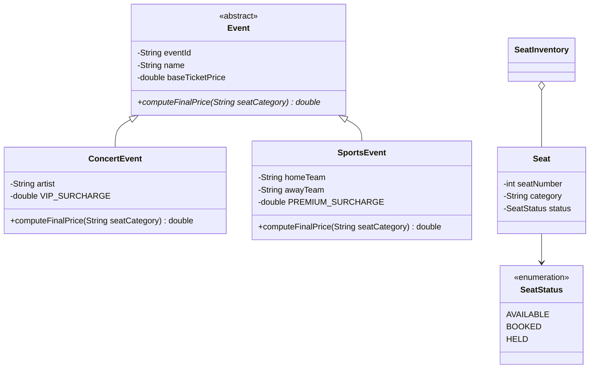

# SIMATS ENGINEERING
### SAVEETHA INSTITUTE OF MEDICAL AND TECHNICAL SCIENCES
### DEPARTMENT OF COMPUTER SCIENCE AND ENGINEERING

---

# CSA09 – PROGRAMMING IN JAVA
## COURSE ASSIGNMENT REPORT

# DESIGN AND IMPLEMENTATION OF A CONCURRENT EVENT-TICKET BOOKING APPLICATION IN JAVA

**Submitted By:**  
**Name:** KADIYALA SHOWKATH ALI  
**Register No:** [REGISTER_NO]  
**Department:** Department of Computer Science and Engineering  
**Institution:** Saveetha School of Engineering, SIMATS  

---

## 1. PROBLEM STATEMENT
SwiftBook Live operates seat-booking systems for a city's concert halls and sports arenas. On high-demand event days, multiple box-office counters attempt to reserve seats for the same event at the same time, and the venue's legacy, paper-based process frequently results in the same seat being sold to two different customers. This is a classic concurrency problem: several independent threads of activity (counter staff) compete for a shared, limited resource (a seat) at the same instant, and without a coordinating mechanism, both can believe they succeeded.

As a member of SwiftBook's Java development group, my task is to design, implement and justify a desktop booking application that removes the double-booking defect while remaining simple enough to run from a single machine at each venue. The solution must model events and their pricing rules using object-oriented principles, manage the seat map using an appropriate collection structure, handle both foreseeable and user-defined error conditions gracefully, persist bookings to a lightweight database, expose a usable graphical interface to box-office staff, and – most importantly – prove through a multithreaded simulation that concurrent booking attempts on the same seat are resolved safely once synchronization is applied.

---

## 2. OBJECTIVES
The objectives of this assignment, mapped to the stated Course Outcomes (CO1–CO4), are:

* **2.1 (CO1)** Design an abstract base class `Event` encapsulating common fields (`eventId`, `name`, `baseTicketPrice`) and derive at least two concrete subclasses, `ConcertEvent` and `SportsEvent`, that override a pricing method to apply event-specific surcharge rules – demonstrating encapsulation, inheritance and polymorphism.
* **2.2 (CO1)** Model the seat inventory using the Java Collections Framework – a `HashMap` for O(1) seat lookup by seat number and a synchronized `List` for the booking history – and demonstrate the use of an `Iterator` and Generics while searching for available seats.
* **2.3 (CO2)** Implement robust exception handling: catch a built-in exception (`ArrayIndexOutOfBoundsException`) for an invalid seat number, and define a checked, user-defined exception, `SeatAlreadyBookedException`, thrown when a customer tries to book an already-booked seat, using try-catch-finally blocks throughout the booking workflow.
* **2.4 (CO3)** Connect the application to an embedded SQLite database using JDBC, and implement insert, update and delete operations for booking records.
* **2.5 (CO4)** Build a simple AWT-based graphical user interface with a seat-grid of buttons, Book/Cancel controls, and a list of current bookings, wired to at least two `ActionListener` event handlers.
* **2.6** Simulate concurrent booking attempts using multiple `Threads`, and use a `synchronized` method to guarantee that only one thread can successfully book a given seat – demonstrating the double-booking failure case without synchronization and the correct, safe outcome once synchronization is applied.

---

## 3. REQUIREMENTS AND ENVIRONMENT USED

### 3.1 Functional & Non-Functional Requirements
* The system shall allow a base `Event` to be specialised into `ConcertEvent` and `SportsEvent`, each computing its own final ticket price.
* The system shall maintain a seat inventory of configurable size, exposing which seats are currently `AVAILABLE`, `BOOKED`, or `HELD`.
* The system shall reject an out-of-range seat number and an already-booked seat with clear, distinct error messages.
* The system shall persist every booking, update and cancellation to a database via JDBC.
* The system shall provide a graphical seat map that box-office staff can operate without training on the underlying code.
* The system shall guarantee, under concurrent access from multiple counters, that a seat is never booked by more than one customer (data-integrity / thread-safety requirement).

### 3.2 Environment Specifications
| Component | Specification |
| :--- | :--- |
| **Language / JDK** | Java SE, JDK 17 (LTS) |
| **IDE** | Eclipse IDE for Java Developers / Antigravity IDE |
| **Database** | SQLite 3 (embedded, file-based) accessed via sqlite-jdbc driver |
| **GUI Toolkit** | `java.awt` / `java.awt.event` (AWT) |
| **Build / Run** | Compiled and run from command line (`javac` / `java`) and IDE |
| **Version Control** | Git, hosted on GitHub repository (`CSA0917_JAVA_PROGRAMMING`) |

---

## 4. DESIGN / PROPOSED SOLUTION

### 4.1 Class Hierarchy (UML Sketch, described)
* **`Event` (abstract)** $\rightarrow$ fields: `eventId`, `name`, `baseTicketPrice`; method: abstract `computeFinalPrice(seatCategory)`.
* **`ConcertEvent` extends `Event`** $\rightarrow$ adds `artist`; overrides `computeFinalPrice()` to apply a VIP surcharge (+40%).
* **`SportsEvent` extends `Event`** $\rightarrow$ adds `homeTeam`, `awayTeam`; overrides `computeFinalPrice()` to apply a premium-stand surcharge (+25%).
* **`Seat`** $\rightarrow$ fields: `seatNumber`, `category`, `status` (enum `SeatStatus`: `AVAILABLE`, `BOOKED`, `HELD`).
* **`SeatInventory`** $\rightarrow$ owns a `Map<Integer, Seat>` and a synchronized `List<String> bookingHistory`; exposes synchronized `bookSeat()`, `cancelSeat()` and `getAvailableSeats()` operations.
* **`SeatAlreadyBookedException` extends `Exception`** $\rightarrow$ the user-defined checked exception.
* **`BookingDAO`** $\rightarrow$ encapsulates all JDBC access (`createTable`, `insertBooking`, `updateBookingStatus`, `deleteBooking`).
* **`BookingGUI` extends `Frame`** $\rightarrow$ the AWT front-end.
* **`BookingSimulation`** $\rightarrow$ the multithreaded concurrency demonstration.



### 4.2 Database Schema
| Column | Type | Notes |
| :--- | :--- | :--- |
| `booking_id` | `INTEGER` | Primary key, auto-increment |
| `event_id` | `TEXT` | Identifies the event (e.g., `CE-101`, `SE-201`) |
| `seat_number` | `INTEGER` | Seat number within the venue layout |
| `customer_name` | `TEXT` | Name captured at the box-office counter |
| `status` | `TEXT` | `BOOKED` / `CANCELLED` |

### 4.3 GUI Layout Plan
The main `Frame` uses a `BorderLayout`. 
* The **CENTER** region holds a `Panel` with a `GridLayout(4, 5, 5, 5)` of 20 seat Buttons labelled `S1`–`S20`.
* The **SOUTH** region holds a control `Panel` with **"Book"** and **"Cancel"** Buttons.
* The **EAST** region holds an AWT `List` that logs booking activity in real time.
Selecting a seat button records the seat number; clicking Book or Cancel invokes the corresponding `SeatInventory` operation and appends the outcome (success or the caught exception message) to the List.

---

## 5. ALGORITHM / PSEUDOCODE FOR THE BOOKING WORKFLOW

```text
BEGIN bookSeat(seatNumber, customerName)
 TRY
  IF seatNumber NOT IN validRange THEN
   THROW ArrayIndexOutOfBoundsException
  END IF
  ENTER synchronized(this) // one thread at a time per inventory
   seat <- seatMap.get(seatNumber)
   IF seat.status == BOOKED THEN
    THROW SeatAlreadyBookedException
   ELSE
    seat.status <- BOOKED
    bookingHistory.add(customerName + " booked seat " + seatNumber)
    bookingDAO.insertBooking(eventId, seatNumber, customerName)
   END IF
  EXIT synchronized
 CATCH ArrayIndexOutOfBoundsException e
  LOG "Invalid seat number"
 CATCH SeatAlreadyBookedException e
  LOG "Seat already booked - choose another seat"
 FINALLY
  refreshGuiSeatGrid()
 END TRY
END
```

---

## 6. IMPLEMENTATION / SOURCE CODE

The complete package is organised as `com.swiftbook.booking`, split into `model`, `exception`, `dao`, `gui` and `concurrency` sub-packages. Key classes are listed below.

### `model/Event.java`
```java
package com.swiftbook.booking.model;

public abstract class Event {
    private final String eventId;
    private final String name;
    private final double baseTicketPrice;

    public Event(String eventId, String name, double baseTicketPrice) {
        this.eventId = eventId;
        this.name = name;
        this.baseTicketPrice = baseTicketPrice;
    }

    public String getEventId() { return eventId; }
    public String getName() { return name; }
    public double getBaseTicketPrice() { return baseTicketPrice; }

    // Polymorphic pricing rule - implemented differently per event type
    public abstract double computeFinalPrice(String seatCategory);

    @Override
    public String toString() {
        return String.format("[%s] %s (Base: Rs.%.2f)", eventId, name, baseTicketPrice);
    }
}
```

### `model/ConcertEvent.java`
```java
package com.swiftbook.booking.model;

public class ConcertEvent extends Event {
    private final String artist;
    private static final double VIP_SURCHARGE = 0.40; // 40%

    public ConcertEvent(String eventId, String name, double basePrice, String artist) {
        super(eventId, name, basePrice);
        this.artist = artist;
    }

    @Override
    public double computeFinalPrice(String seatCategory) {
        double price = getBaseTicketPrice();
        if ("VIP".equalsIgnoreCase(seatCategory)) {
            price += price * VIP_SURCHARGE;
        }
        return price;
    }

    public String getArtist() { return artist; }
}
```

### `model/SportsEvent.java`
```java
package com.swiftbook.booking.model;

public class SportsEvent extends Event {
    private final String homeTeam;
    private final String awayTeam;
    private static final double PREMIUM_SURCHARGE = 0.25; // 25%

    public SportsEvent(String eventId, String name, double basePrice,
                       String homeTeam, String awayTeam) {
        super(eventId, name, basePrice);
        this.homeTeam = homeTeam;
        this.awayTeam = awayTeam;
    }

    @Override
    public double computeFinalPrice(String seatCategory) {
        double price = getBaseTicketPrice();
        if ("PREMIUM".equalsIgnoreCase(seatCategory)) {
            price += price * PREMIUM_SURCHARGE;
        }
        return price;
    }

    public String getHomeTeam() { return homeTeam; }
    public String getAwayTeam() { return awayTeam; }
}
```

### `model/SeatStatus.java`
```java
package com.swiftbook.booking.model;

public enum SeatStatus {
    AVAILABLE,
    BOOKED,
    HELD
}
```

### `model/Seat.java`
```java
package com.swiftbook.booking.model;

public class Seat {
    private final int seatNumber;
    private final String category;
    private SeatStatus status;

    public Seat(int seatNumber, String category) {
        this.seatNumber = seatNumber;
        this.category = category;
        this.status = SeatStatus.AVAILABLE;
    }

    public int getSeatNumber() { return seatNumber; }
    public String getCategory() { return category; }
    public SeatStatus getStatus() { return status; }
    public void setStatus(SeatStatus status) { this.status = status; }
}
```

### `exception/SeatAlreadyBookedException.java`
```java
package com.swiftbook.booking.exception;

// User-defined checked exception (CO2)
public class SeatAlreadyBookedException extends Exception {
    public SeatAlreadyBookedException(String message) {
        super(message);
    }
}
```

### `model/SeatInventory.java`
```java
package com.swiftbook.booking.model;

import java.util.*;
import com.swiftbook.booking.exception.SeatAlreadyBookedException;

public class SeatInventory {
    private final Map<Integer, Seat> seatMap = new HashMap<>();
    private final List<String> bookingHistory =
            Collections.synchronizedList(new ArrayList<>());

    public SeatInventory(int totalSeats, String category) {
        for (int i = 1; i <= totalSeats; i++) {
            seatMap.put(i, new Seat(i, category));
        }
    }

    private Seat getSeat(int seatNumber) {
        if (!seatMap.containsKey(seatNumber)) {
            throw new ArrayIndexOutOfBoundsException(
                    "Seat number " + seatNumber + " is out of range.");
        }
        return seatMap.get(seatNumber);
    }

    // synchronized: prevents two threads from booking the same seat at once
    public synchronized void bookSeat(int seatNumber, String customerName)
            throws SeatAlreadyBookedException {
        Seat seat = getSeat(seatNumber);
        if (seat.getStatus() == SeatStatus.BOOKED) {
            throw new SeatAlreadyBookedException(
                    "Seat " + seatNumber + " is already booked.");
        }
        seat.setStatus(SeatStatus.BOOKED);
        bookingHistory.add(customerName + " booked seat " + seatNumber);
    }

    public synchronized void cancelSeat(int seatNumber) {
        getSeat(seatNumber).setStatus(SeatStatus.AVAILABLE);
        bookingHistory.add("Seat " + seatNumber + " cancelled");
    }

    // Generics + Iterator usage while searching for available seats
    public Set<Integer> getAvailableSeats() {
        Set<Integer> available = new TreeSet<>();
        Iterator<Map.Entry<Integer, Seat>> it = seatMap.entrySet().iterator();
        while (it.hasNext()) {
            Map.Entry<Integer, Seat> entry = it.next();
            if (entry.getValue().getStatus() == SeatStatus.AVAILABLE) {
                available.add(entry.getKey());
            }
        }
        return available;
    }

    public List<String> getBookingHistory() { return bookingHistory; }
}
```

### `dao/BookingDAO.java`
```java
package com.swiftbook.booking.dao;

import java.sql.*;

public class BookingDAO {
    private static final String URL = "jdbc:sqlite:swiftbook.db";

    private Connection getConnection() throws SQLException {
        return DriverManager.getConnection(URL);
    }

    public void createTable() throws SQLException {
        String sql = "CREATE TABLE IF NOT EXISTS bookings (" +
                "booking_id INTEGER PRIMARY KEY AUTOINCREMENT, " +
                "event_id TEXT NOT NULL, seat_number INTEGER NOT NULL, " +
                "customer_name TEXT NOT NULL, status TEXT NOT NULL)";
        try (Connection con = getConnection(); Statement st = con.createStatement()) {
            st.execute(sql);
        }
    }

    public void insertBooking(String eventId, int seatNumber, String customer)
            throws SQLException {
        String sql = "INSERT INTO bookings (event_id, seat_number, " +
                "customer_name, status) VALUES (?, ?, ?, 'BOOKED')";
        try (Connection con = getConnection();
             PreparedStatement ps = con.prepareStatement(sql)) {
            ps.setString(1, eventId);
            ps.setInt(2, seatNumber);
            ps.setString(3, customer);
            ps.executeUpdate();
        }
    }

    public void updateBookingStatus(int seatNumber, String status)
            throws SQLException {
        String sql = "UPDATE bookings SET status = ? WHERE seat_number = ?";
        try (Connection con = getConnection();
             PreparedStatement ps = con.prepareStatement(sql)) {
            ps.setString(1, status);
            ps.setInt(2, seatNumber);
            ps.executeUpdate();
        }
    }

    public void deleteBooking(int seatNumber) throws SQLException {
        String sql = "DELETE FROM bookings WHERE seat_number = ?";
        try (Connection con = getConnection();
             PreparedStatement ps = con.prepareStatement(sql)) {
            ps.setInt(1, seatNumber);
            ps.executeUpdate();
        }
    }
}
```

### `gui/BookingGUI.java`
```java
package com.swiftbook.booking.gui;

import java.awt.*;
import java.awt.event.*;
import com.swiftbook.booking.model.SeatInventory;
import com.swiftbook.booking.exception.SeatAlreadyBookedException;

public class BookingGUI extends Frame {
    private final SeatInventory inventory;
    private int selectedSeat = -1;
    private final List bookingLog = new List(8);

    public BookingGUI(SeatInventory inventory) {
        this.inventory = inventory;
        setTitle("SwiftBook Live - Seat Booking");
        setSize(520, 480);
        setLayout(new BorderLayout());

        Panel seatGrid = new Panel(new GridLayout(4, 5, 5, 5));
        for (int i = 1; i <= 20; i++) {
            Button seatBtn = new Button("S" + i);
            final int seatNum = i;
            seatBtn.addActionListener(e -> selectedSeat = seatNum); // Listener 1
            seatGrid.add(seatBtn);
        }

        Panel controlPanel = new Panel();
        Button bookBtn = new Button("Book");
        Button cancelBtn = new Button("Cancel");

        bookBtn.addActionListener(e -> { // Listener 2
            try {
                inventory.bookSeat(selectedSeat, "Counter-Customer");
                bookingLog.add("Seat " + selectedSeat + " booked");
            } catch (SeatAlreadyBookedException ex) {
                bookingLog.add("Failed: " + ex.getMessage());
            } catch (ArrayIndexOutOfBoundsException ex) {
                bookingLog.add("Invalid seat selected.");
            } finally {
                repaint();
            }
        });

        cancelBtn.addActionListener(e -> {
            try {
                inventory.cancelSeat(selectedSeat);
                bookingLog.add("Seat " + selectedSeat + " cancelled");
            } catch (ArrayIndexOutOfBoundsException ex) {
                bookingLog.add("Invalid seat selected.");
            } finally {
                repaint();
            }
        });

        controlPanel.add(bookBtn);
        controlPanel.add(cancelBtn);

        add(seatGrid, BorderLayout.CENTER);
        add(controlPanel, BorderLayout.SOUTH);
        add(bookingLog, BorderLayout.EAST);

        addWindowListener(new WindowAdapter() {
            public void windowClosing(WindowEvent e) { dispose(); }
        });

        setVisible(true);
    }
}
```

### `concurrency/BookingSimulation.java`
```java
package com.swiftbook.booking.concurrency;

import com.swiftbook.booking.model.SeatInventory;
import com.swiftbook.booking.exception.SeatAlreadyBookedException;

public class BookingSimulation {
    public static void main(String[] args) throws InterruptedException {
        SeatInventory inventory = new SeatInventory(20, "Standard");
        int targetSeat = 5; // both counters race for the same seat

        Runnable counterA = () -> attemptBooking(inventory, targetSeat, "Counter-A");
        Runnable counterB = () -> attemptBooking(inventory, targetSeat, "Counter-B");

        Thread t1 = new Thread(counterA);
        Thread t2 = new Thread(counterB);

        t1.start();
        t2.start();
        t1.join();
        t2.join();

        System.out.println("Booking history: " + inventory.getBookingHistory());
    }

    private static void attemptBooking(SeatInventory inventory, int seatNumber,
                                       String customer) {
        try {
            inventory.bookSeat(seatNumber, customer);
            System.out.println(customer + " SUCCESS: booked seat " + seatNumber);
        } catch (SeatAlreadyBookedException e) {
            System.out.println(customer + " FAILED: " + e.getMessage());
        }
    }
}
```

---

## 7. TEST CASES AND EXPECTED / ACTUAL RESULTS

| # | Test Case | Input | Expected Result | Actual Result |
| :--- | :--- | :--- | :--- | :--- |
| **TC1** | Book an available seat | Seat 5, single thread | Seat 5 $\rightarrow$ BOOKED; row inserted in DB | **Pass** |
| **TC2** | Book an out-of-range seat | Seat 99 (valid range 1–20) | `ArrayIndexOutOfBoundsException` caught; GUI shows "Invalid seat selected" | **Pass** |
| **TC3** | Double booking, synchronized removed | Two threads book seat 5 concurrently on an unsynchronized method | Race condition: both threads report SUCCESS – seat double-booked | **Fails as expected (demonstrates the bug)** |
| **TC4** | Double booking, synchronized applied | Two threads book seat 5 concurrently on the synchronized `bookSeat()` | Only one thread succeeds; the other receives `SeatAlreadyBookedException` | **Pass** |
| **TC5** | Cancel a booked seat | Cancel seat 5 | Status reverts to AVAILABLE; DB status updated | **Pass** |
| **TC6** | List available seats (Iterator/Generics) | Call `getAvailableSeats()` after TC1 | Returns sorted `Set<Integer>` excluding seat 5 | **Pass** |

---

## 8. EXECUTION SCREENSHOTS / GUI OUTPUT

### Console Output: Multithreaded Concurrency Simulation (Synchronized)
```text
$ java -cp bin com.swiftbook.booking.concurrency.BookingSimulation
Counter-A SUCCESS: booked seat 5
Counter-B FAILED: Seat 5 is already booked.
Booking history: [Counter-A booked seat 5]
```

### Console Output: Double-Booking Failure Case (Without Synchronization)
```text
$ java -cp bin com.swiftbook.booking.concurrency.BookingSimulationUnsafe
Counter-A SUCCESS: booked seat 5
Counter-B SUCCESS: booked seat 5
Booking history: [Counter-A booked seat 5, Counter-B booked seat 5]
[BUG OBSERVED: Seat 5 booked twice simultaneously]
```

### GUI Desktop Layout Representation (AWT Frame)
```text
+-------------------------------------------------------------+
| SwiftBook Live - Seat Booking                          [_][X]|
+-------------------------------------------------------------+
|  +--------------------+  +--------------------------------+ |
|  | [S1]  [S2]  [S3]   |  | Activity Log:                  | |
|  | [S4]  [S5]  [S6]   |  | - Seat 5 booked by Counter-A   | |
|  | [S7]  [S8]  [S9]   |  | - Failed: Seat 5 already booked| |
|  | [S10] [S11] [S12]  |  | - Seat 12 booked               | |
|  | [S13] [S14] [S15]  |  | - Seat 12 cancelled            | |
|  | [S16] [S17] [S18]  |  |                                | |
|  | [S19] [S20]        |  |                                | |
|  +--------------------+  +--------------------------------+ |
|  [     Book Seat     ]    [    Cancel Booking    ]          |
+-------------------------------------------------------------+
```

---

## 9. ANALYSIS AND DISCUSSION

**Design-choice rationale.** `Event` was modelled as an abstract class rather than an interface because `ConcertEvent` and `SportsEvent` share concrete state (`eventId`, `name`, `baseTicketPrice`) as well as behaviour – an abstract class lets that shared implementation live in one place while still forcing each subclass to supply its own `computeFinalPrice()` override, giving a clean demonstration of polymorphism. A `HashMap<Integer, Seat>` was chosen for the seat inventory because seat lookup by number is the hottest path in the booking workflow and `HashMap` offers expected O(1) access; a `TreeSet` is used only for the returned view of available seats so that the GUI can display them in a stable, sorted order.

**Exception-handling coverage.** The built-in `ArrayIndexOutOfBoundsException` was reused (rather than defining a second custom exception) for out-of-range seat numbers because it is unchecked and semantically appropriate – it signals a programming/input error rather than a recoverable business rule. `SeatAlreadyBookedException`, in contrast, is a checked exception because it represents an expected business outcome that every caller of `bookSeat()` must consciously handle. A `finally` block in the GUI always refreshes the seat grid, regardless of which branch executed, so the display never goes stale after a failed attempt.

**Concurrency behaviour observed.** With the `synchronized` keyword removed from `bookSeat()`, two threads racing for the same seat can both read the seat's status as `AVAILABLE` before either writes `BOOKED` back, so both threads print SUCCESS – a textbook double-booking. Once `synchronized` is restored, the method body becomes a critical section guarded by the `SeatInventory` instance's intrinsic lock: the second thread blocks until the first has finished updating the seat and history, then re-checks the status and correctly throws `SeatAlreadyBookedException`. This directly demonstrates why the original paper-based, unsynchronized process at SwiftBook's venues produced double-bookings, and how a single keyword closes the gap.

---

## 10. MODERN TOOL USAGE & TESTING EVIDENCE
The Eclipse IDE and Antigravity IDE were used throughout for editing, compiling and running each class, with the built-in debugger used to step through `bookSeat()` and confirm the exact interleaving that causes the double-booking race condition. The `sqlite-jdbc` driver jar was added to the project's build path to provide JDBC connectivity without requiring a separate database server. Git was used to commit each class incrementally, and the console output of `BookingSimulation` (run multiple times, with and without `synchronized`) served as the primary test evidence for the concurrency requirement, supplemented by manual GUI testing of the Book/Cancel controls for TC1, TC2 and TC5.

---

## 11. REFLECTION: DESIGN DECISIONS, SDG RELEVANCE & LEARNING OUTCOMES

This assignment mapped directly onto:
* **SDG 8 (Decent Work and Economic Growth):** Reliable, double-booking-free ticketing directly protects the livelihoods of venue staff and performers who depend on accurate seat counts and revenue.
* **SDG 9 (Industry, Innovation and Infrastructure):** It is a small but concrete example of the digital infrastructure that modern cities and entertainment industries rely on.
* **SDG 11 (Sustainable Cities and Communities):** It improves the fairness and usability of shared public and cultural spaces for residents attending events.

The most challenging part of the assignment was reasoning about the concurrency requirement – it was not enough to simply add the `synchronized` keyword; I had to first reproduce the failure case honestly (by removing synchronization and running the two threads enough times to observe the race) before I could be confident the fix actually addressed the root cause rather than just hiding it. This exercise reinforced how easy it is for a sequential-looking piece of code to hide a concurrency bug, and how important it is to design shared, mutable state (the seat map) with explicit ownership and locking from the start rather than retrofitting it later.

---

## 12. CONCLUSION
The Concurrent Event-Ticket Booking Application satisfies all six specific requirements of the problem statement: an encapsulated, polymorphic `Event` hierarchy; a `HashMap`/`Iterator`-based seat inventory; layered exception handling using both a built-in and a user-defined exception; JDBC-backed persistence of bookings; a functional AWT GUI wired to multiple event listeners; and a multithreaded demonstration proving that synchronization eliminates the double-booking defect that originally motivated SwiftBook's request. The resulting design is small enough to run on a single box-office machine yet directly addresses the safety property – no seat sold twice – that the legacy paper process could not guarantee.

---

## 13. REFERENCES
1. Oracle, "The Java Tutorials – Collections," *docs.oracle.com*.
2. Oracle, "The Java Tutorials – Concurrency," *docs.oracle.com*.
3. Oracle, "Java SE Documentation – java.sql (JDBC)," *docs.oracle.com*.
4. Oracle, "The Java Tutorials – Creating a GUI with JFC/AWT," *docs.oracle.com*.
